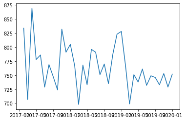

# Introduction

Car accidents are no trivial matter in the United States. Roughly 800 car accidents occur every day in Illinois alone [@tribune]. Our project is to develop models to both predict and explain a subset of these entirely avoidable accidents in Chicago, Illinois. OpenWeather's historical weather database and the city government of Chicago's website to construct these models and insights. We also obtained the boundaries of the police beats from the city of Chicago's website. These datasets include factors that are widely believed to contribute to higher accident rates, such as weather, time, location, road conditions, and so forth.

  The primary goal of our exploration is to explore useful features for predicting the number of accidents in a given police shift in location clusters called "police beats". We hope that the results of our project could be used to further optimize the allocation of first responders across these beats. We believe that the effectiveness of a good prediction algorithm would be measured using one of the many of the many scoring rules described in [@czado]. As of this moment,we find the Dawid-Sebastiani and squared error scores to be the most appealing. 
  
  We now turn to the specifics of the data.
 
# Data
  
  


```python
import numpy as np
import pandas as pd
import matplotlib.pyplot as plt
import geopandas as gpd
import seaborn as sns

# Define data types of attributes
dtypes = {'CRASH_DATE_EST_I': 'category', 'TRAFFIC_CONTROL_DEVICE': 'category', 'DEVICE_CONDITION': 'category',
         'WEATHER_CONDITION': 'category', 'LIGHTING_CONDITION': 'category', 'FIRST_CRASH_TYPE': 'category',
         'TRAFFICWAY_TYPE': 'category', 'ROADWAY_SURFACE_COND': 'category', 'ROAD_DEFECT': 'category',
         'REPORT_TYPE': 'category', 'CRASH_TYPE': 'category', 'INTERSECTION_RELATED_I': 'category',
         'NOT_RIGHT_OF_WAY_I': 'category', 'HIT_AND_RUN_I': 'category', 'DAMAGE': 'category', 
         'PRIM_CONTRIBUTORY_CAUSE': 'category', 'SEC_CONTRIBUTORY_CAUSE': 'category', 'STREET_DIRECTION': 'category',
         'STREET_NAME': 'category', 'PHOTOS_TAKEN_I': 'category', 'STATEMENTS_TAKEN_I': 'category',
         'DOORING_I': 'category', 'WORK_ZONE_I': 'category', 'WORK_ZONE_TYPE': 'category', 'WORKERS_PRESENT_I': 'category',
         'MOST_SEVERE_INJURY': 'category'}

# Import the datasets
beats = gpd.read_file("data/policebeats.geojson")
weather = pd.read_csv("data/ChicagoWeather.csv", parse_dates = ['dt_iso'], usecols=['dt_iso', 'weather_main',
                                                                                           'weather_description'],
                     dtype={'weather_main':'category', 'weather_description':'category'})
crashes = pd.read_csv("data/TrafficCrashesChicago.csv", dtype=dtypes, parse_dates = ['CRASH_DATE', 'DATE_POLICE_NOTIFIED'])
```

We found that the crash data prior to 2017 was infrequently captured, which leads us to not trust it. Therefore, we decided to remove data prior to 2017. This is not really a problem because the vast majority of the data comes after 2017. We also merge the data sets, which requires us to resample our time series component in the process because the weather data was captured hourly.


```python
weather['dt_iso'] = pd.to_datetime(weather['dt_iso'],format="%Y-%m-%d %H:00:00 +0000 UTC")
weather.info()
```

    <class 'pandas.core.frame.DataFrame'>
    RangeIndex: 63859 entries, 0 to 63858
    Data columns (total 3 columns):
    dt_iso                 63859 non-null datetime64[ns]
    weather_main           63859 non-null category
    weather_description    63859 non-null category
    dtypes: category(2), datetime64[ns](1)
    memory usage: 625.6 KB


```python
# Delete Data from before 2017
crashes = crashes[crashes.CRASH_DATE > '2017-01-01 00:00:00']
crashes_shortened = crashes[crashes.CRASH_DATE < '2019-12-31 23:59:59']

# Translate Crash Hours into Police Shifts
# Police Officer Shift Intervals. 1 starts at 6AM, 2 starts at 2PM, and 3 starts at 10PM.
shifts = dict.fromkeys([22, 23, 0, 1, 2, 3, 4, 5], 3)
shifts.update(dict.fromkeys([6, 7, 8, 9, 10, 11, 12, 13], 1))
shifts.update(dict.fromkeys([14, 15, 16, 17, 18, 19, 20, 21], 2))

crashes_shortened['SHIFT'] = crashes_shortened['CRASH_HOUR'].map(shifts)

# Aggregations for Groupby
aggregations = dict.fromkeys(['NUM_UNITS', 'INJURIES_TOTAL', 'INJURIES_FATAL',
                              'INJURIES_INCAPACITATING', 'INJURIES_NON_INCAPACITATING', 'INJURIES_REPORTED_NOT_EVIDENT',
                              'INJURIES_NO_INDICATION', 'INJURIES_UNKNOWN'], np.sum)
aggregations.update({'HIT_AND_RUN_I': 'count', 'RD_NO': 'size', 'CRASH_HOUR': 'size'})

crashes_beats_downsampled = crashes_shortened.set_index(['CRASH_DATE', 'SHIFT']).groupby(pd.Grouper(freq='H', level=0)).agg(aggregations)
                                                          
# Merge weather and crashes dataset
crashes_new = crashes_beats_downsampled.reset_index().merge(weather, how="left",
                                              left_on='CRASH_DATE', right_on='dt_iso')                                            
                                                          
```

    /home/kevin/Development/ds@smu/SurvivingChicago/venv/lib/python3.6/site-packages/ipykernel_launcher.py:11: SettingWithCopyWarning: 
    A value is trying to be set on a copy of a slice from a DataFrame.
    Try using .loc[row_indexer,col_indexer] = value instead
    
    See the caveats in the documentation: http://pandas.pydata.org/pandas-docs/stable/user_guide/indexing.html#returning-a-view-versus-a-copy
      # This is added back by InteractiveShellApp.init_path()


```python
# Marginalize across days of the month

aggregations = dict.fromkeys(['NUM_UNITS', 'INJURIES_TOTAL', 'INJURIES_FATAL', 'INJURIES_INCAPACITATING',
                        'INJURIES_NON_INCAPACITATING', 'INJURIES_REPORTED_NOT_EVIDENT', 'INJURIES_NO_INDICATION',
                        'INJURIES_UNKNOWN'], np.sum)
aggregations.update(dict.fromkeys(['weather_main', 'RD_NO', 'weather_description', 'HIT_AND_RUN_I'], 'size'))
crashes_over_time = crashes_new.groupby(pd.Grouper(key='CRASH_DATE', freq='M')).agg(aggregations)
crashes_over_time = crashes_over_time.rename(columns = {'RD_NO':'NUM_ACCIDENTS'})
```


```python
# plot time series of monthly crashes
plt.plot(crashes_over_time.index, crashes_over_time.NUM_ACCIDENTS)
```


    [<matplotlib.lines.Line2D at 0x7f43f2f03390>]





In this plot we can see that the time series plot is not covariance stationary. There was a sudden structural break in the variation of accidents per month from 201


```python
import os

os.system("jupyter nbconvert --to markdown projectonepaper.ipynb")
#next convert markdown to ms word
conversion = "pandoc --filter pandoc-citeproc --bibliography=crashes.bib --csl=apa.csl -s projectonepaper.md -o projone.pdf"
os.system(conversion)
```


    0


```python

```
